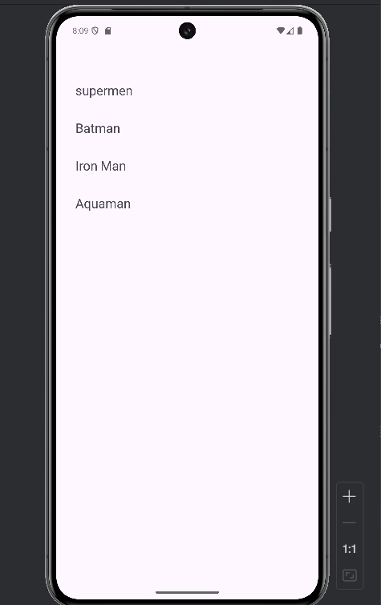
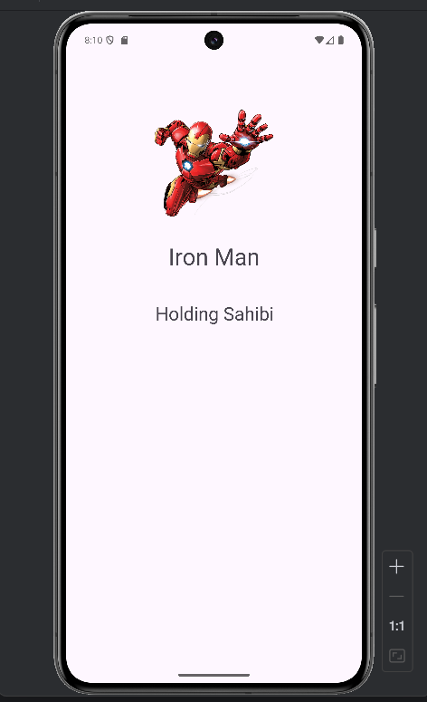

<h1>Hello This is my application development example.</h1>

# What is Kotlin❓

`Kotlin` is a cross-platform, statically typed, general-purpose programming language with type inference. `Kotlin` is designed to interoperate fully with `Java` and the `JVM` version of Kotlin's standard library depends on the `Java` Class Library, but type inference allows its syntax to be more concise.

## The goal of the project 🎯
Starting from the most basic topics about Kotlin, learning advanced topics by myself and creating an interactive project by sharing the information I have learned with you.

## Project Content 🛠
It's a project that contains various information and examples about the basics of programming with Kotlin.

Technologies it uses
Kotlin
Andoid Studio
Xml

